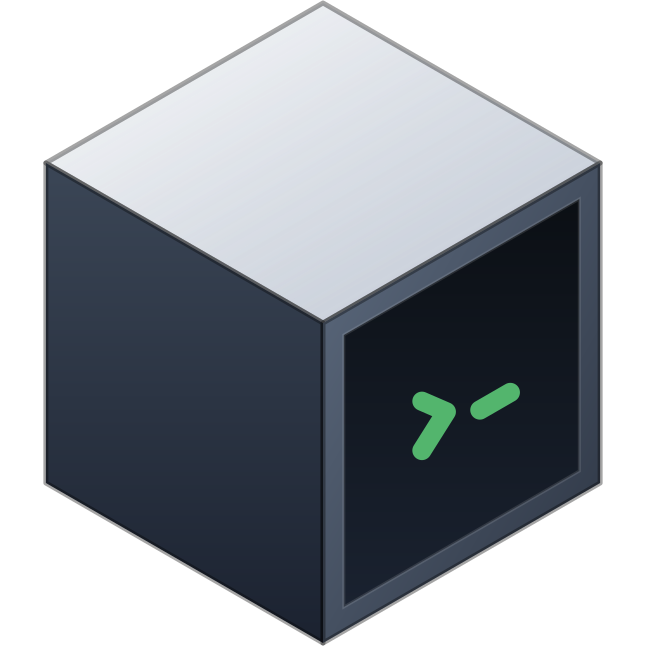
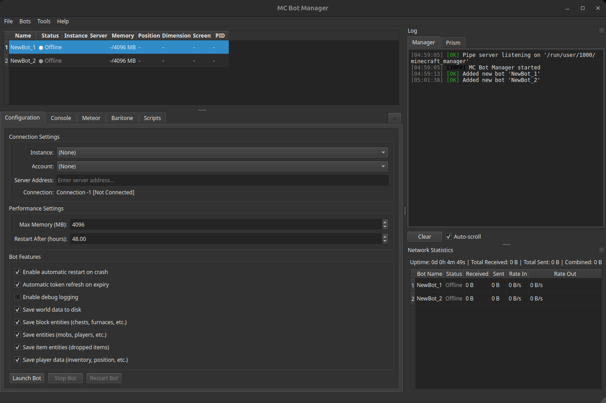

<p align="center">

</p>

<h1 align="center">MC Bot Manager</h1>



A desktop application for managing and automating multiple Minecraft clients. Each client runs a Fabric mod that connects back to the manager, which can then control it, and run Python scripts against it.

## Architecture

Two components communicate over Protocol Buffers via Unix domain sockets:

- **Client** (`/client/`) - Fabric mod (Java) that runs inside Minecraft, captures game state, and executes commands
- **Manager** (`/manager/`) - Qt/C++ desktop application for controlling bots and running scripts

## Requirements

**Manager:**
- CMake 3.16+
- Qt6 (Widgets, Network, Protobuf)
- Python 3 (with development headers)
- pybind11

**Client:**
- JDK 21+
- Minecraft 1.21.11 with Fabric Loader

## Building

**Manager:**
```bash
cd manager
cmake -B build -DCMAKE_BUILD_TYPE=Release
cmake --build build
```

**Client:**
```bash
cd client
./gradlew build
```

Place the resulting `.jar` from `client/build/libs/` into your Minecraft mods folder alongside Meteor Client and Baritone.

## Scripting

Bots are automated using Python scripts in the `scripts/` directory. The manager embeds a Python interpreter and exposes APIs for bot control, inventory, world interaction, and crafting.

See the [documentation](https://mankool0.github.io/mc-bot-manager/) for the full scripting API and examples.
